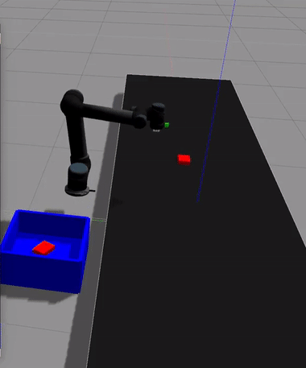

# Vacuum plugin gazebo
based on the existing plugin from https://github.com/ros-simulation/gazebo_ros_pkgs developed by wentaro but ported to for the new version of gazebo harmonic
It has some modifications to generate more force so you don't have to use the workaround of using many plugin instances for the same thing and tailor it to your robot gripper size

# improvements
- added sdf elements that show max_distance, max_force  this shows the maximum force and distnace at whihc the plugin interacts with the environment
- added a scaler to improve the amount of force applied set to one

# Shortcomings
- doesn't use rays and only works for really small items which is good enough for my use case
- Improvements need to be done using the rays in gazebo
- not necessarily a true, real implementation
